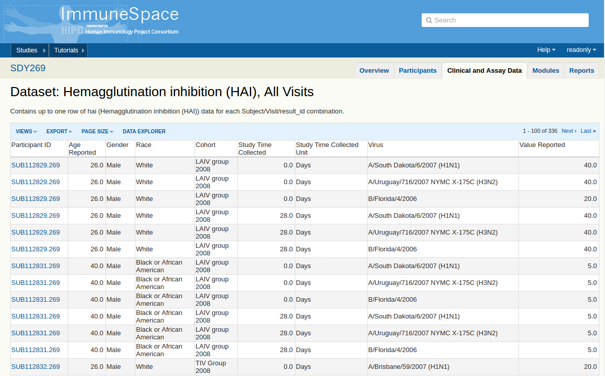
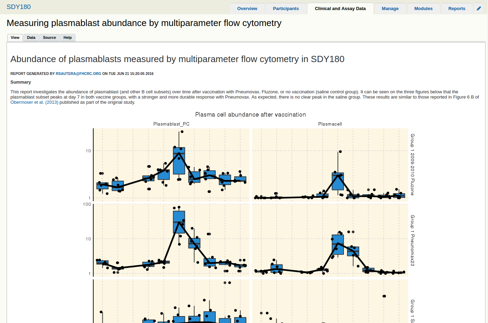

```{r knitr-opts, echo = FALSE}
library(knitr)
opts_chunk$set(message = FALSE, warning = FALSE)
opts_chunk$set(fig.align = "center", fig.width = 10)
```

# Use case: Systems biology of Influenza
Reproducing results of a publication. **Systems biology of vaccination for seasonal
influenza in humans**. [Nakaya et al (2011)](http://www.ncbi.nlm.nih.gov/pubmed/21743478).  
The paper uses system biology approach to study immune response to vaccination 
against influenza in three seasons.  
Two cohorts vaccinated with TIV (2007 & 2008). And one with LAIV (2008).

<hr>
# Without ImmuneSpaceR
## Fetching data from GEO
The data was made available on GEO after publication. The [SuperSeries](http://www.ncbi.nlm.nih.gov/geo/query/acc.cgi?acc=GSE29619)
is referenced in the paper.
```{r usecase}
library(GEOquery)
gse <- getGEO("GSE29619")
```

The returned object is a `list` of 3 `ExpressionSet`s. One per SubSeries/cohort. 
```{r}
gse
```
The seasons cannot be identified without looking in the objects.
```{r}
names(gse)
```

## phenoData
Let's look at the metadata available on GEO
```{r}
library(Biobase)
es_LAIV <- gse[[1]]
head(pData(es_LAIV), 3)
```
### Issues
* The metadata is poorly formated
* Subject ID & visit in the same column
* HAI results mapped using "characteristic_ch1" columns
* No demographics (age, gender, race)
* No mapping to additional datasets (ELISA, ELISPOT, Flow, GE, etc...)

## Combining data
Without any additional information the various seasons cannot be combined.
```{r combine-es, error = TRUE}
combine(gse[[1]], gse[[2]])
```
The platforms are different accross seasons.

## Summary
In order to do something simple like differential gene expression analyses:

* Parse the phenoData of each `ExpressionSet` for visit and patient ID  
* Use `annotate` to map probes to genes  
* `combine` into one expression matrix  
* Run DGEA (limma)  

Combining this information with another dataset would require additional data
cleaning (assuming the IDs are consistent accros experiment).

<hr>
# With ImmuneSpaceR
This study was funded by HIPC. As a result, all of its data has been 
curated and standardized by [ImmPort](http://www.immport.org/immport-open/public/home/home)
and is now publicly available on ImmuneSpace. We will use ImmuneSpaceR to 
retrieve the gene-expression data and associated metadata.

## Connect to ImmuneSpace

The study SDY269 holds the data for the two 2008 cohorts, LAIV and TIV. <br>

<center>A study overview page on ImmuneSpace</center>
<br>
First, we instantiate a connection to the study of interest. 
```{r CreateConnection269}
library(ImmuneSpaceR)
sdy269 <- CreateConnection("SDY269")
sdy269
```
The returned `ImmuneSpaceConnection` object shows available datasets and 
expression matrices available for the selected study. ImmuneSpace uses
Reference classes or `R5`. Functions are members of the object, thus the $ 
semantics to access member functions in the following samples.

## Download gene expression
```{r getGEM_TIV2008}
TIV2008 <- sdy269$getGEMatrix("TIV_2008")
TIV2008
```
```{r pdata_TIV2008}
head(pData(TIV2008))
```
Only essential information is displayed in the phenoData, 

## Do I have to do this for every cohort?
`getGEMatrix` accepts multiple IDs as input. Additionally setting `summary = TRUE`
returns the matrix with expression values averaged by gene. Allowing an easy 
merge of the two ExpressionSets.

```{r getGEM_multicohorts}
es269 <- sdy269$getGEMatrix(c("TIV_2008", "LAIV_2008"), summary = TRUE)
es269
```
For convenience, cohorts can also be downloaded by names.
```{r getGEM_cohortnames}
es269 <- sdy269$getGEMatrix(cohort = c("TIV Group 2008", "LAIV group 2008"), summary = TRUE)
```

## Do I have to do this for every study?
SDY269 only contains the two cohorts asociated with the 2008 season but the GEO 
SuperSeries had three cohorts. The data has been split between multiple studies.
SDY61 contains the data for the 2007 season. We have to combine the gene-expression
results accross these two studies to get the data that was used in the publication.

In order to query multiple studies, we can instantiate a connection to all 
studies at once.
```{r}
all <- CreateConnection("") #All studies
es <- all$getGEMatrix(c("TIV_2007", "TIV_2008", "LAIV_2008"), summary = TRUE)
head(pData(es))
```
With a single command, we can download the three relevant normalized and 
transformed expression matrices, summarize them by gene and combine into a 
unique ExpressionSet with relevant phenoData.  
It is also a lot faster than GEO as each matrix is available as a single file.

## How about the other datasets?
Unlike expresssion matrices, the other datasets are stored as tables in the
database. 


<center>SDY269 HAI dataset as visible on ImmuneSpace</center>
<br>

### Downloading
They can be accessed using the `getDataset` function.
```{r listds}
library(data.table)
sdy269$listDatasets()
hai <- sdy269$getDataset("hai")
hai
```
For performance, the function returns `data.table` objects. It is especially
interesting when querying accross all studies.

```{r getDataset_cross}
ahai <- all$getDataset("hai")
```

### Dataset filtering

Because `getDataset` is a wrapper around `Rlabkey`'s `labkey.selectRows` function,
we use `makeFilter` to create filters that can be interpreted by LabKey.
```{r makeFilter}
library(Rlabkey)
virus_filter <- makeFilter(c("virus", "CONTAINS", "H1N1"))
hai_f <- sdy269$getDataset("hai", colFilter = virus_filter)
virus_filter2 <- makeFilter(c("virus", "EQUAL", "A/Brisbane/59/2007 (H1N1)"))
hai_f <- sdy269$getDataset("hai", colFilter = virus_filter2)

#multiple filters can be specified
analyte_filter <- makeFilter(c("Analyte", "EQUAL", "IFNg"), c("Study time collected", "IN", "0;7"))
elisa <- sdy269$getDataset("elisa", colFilter = analyte_filter)
```

## Cross assay analysis
With the same information accross datasets, we can merge results from various assay
types.  
Here we use the elispot and flow cytometry results to reproduce Figure 1d of 
Nakaya et al.
```{r cross-assay}
# Elispot
analyte_filter2 <- makeFilter(c("Analyte", "EQUAL", "IgG"), c("Study time collected", "EQUAL", "7"))
elispot <- sdy269$getDataset("elispot", colFilter = analyte_filter2, reload = TRUE)
elispot <- elispot[, elispot_response := spot_number_reported + 1]
elispot <- elispot[, list(participant_id, elispot_response)]

# Flow
fcs <- sdy269$getDataset("fcs_analyzed_result")
fcs <- fcs[, fcs_response := (as.double(population_cell_number) + 1) / as.double(base_parent_population)][study_time_collected == 7]
res <- merge(elispot, fcs, by = "participant_id")

library(ggplot2)
ggplot(res, aes(x = as.double(fcs_response), y = elispot_response, color = cohort)) +
  geom_point() + scale_y_log10() + scale_x_log10() + geom_smooth(method = "lm") + 
  xlab("Total plasmablasts (%)") + ylab("Influenza specific cells\n (per 10^6 PBMCs)") +
  theme_IS()
```
Only a few lines were needed to calculate fold-change and a sinle `merge` operation
is enough to combine data accross assays and bind metadata.

<hr>
# What else?
## Quick plot
For the exploration of most datasets, `quick_plot` is a function that takes
advantage of the standardized datasets to plot the data in a relevant fashion.
It has a limited number of options and should be used for having a first look at
the data.  
More advanced plots can be achieved by downloading the data in the R session, as
seen in the use case above.
```{r quick-plot}
sdy269$quick_plot("hai", normalize = FALSE)
sdy269$quick_plot("hai", filter = virus_filter2, normalize = FALSE, color = "Age", shape = "Gender")
```
This is the same function that is used by the interactive 
[Data Explorer Module](https://www.immunespace.org/DataExplorer/Studies/begin.view).

```{r qp_cross}
virus_filter3 <- makeFilter(c("cohort", "contains", "TIV"), c("study_time_collected", "IN", "0;21;28;30;180"))
all$quick_plot("hai", filter = virus_filter3, normalize = TRUE, color = "Age")
```

## Online R/Rmd reports
The reports available on ImmuneSpace are written using ImmuneSpaceR. The code is
available and will work both through LabKey's report on the web portal and locally.


<center>Example of live report available in SDY180</center>
<br>


## Technical details
* Reference classes for performance and caching
* Connections to the database are made with `RCurl`
* `data.table` for handling downloaded datasets


## Future
* Rework the instantiation to allow connection to a subset of studies.
* Use [Data Finder](https://www.immunespace.org/project/Studies/begin.view) filters in R.
* Integration of Rstudio to ImmuneSpace (spawn pre-filtered R sessions).
* Accept user made R/Rmd reports on ImmuneSpace.
* Improve testing of both ImmuneSpaceR & ImmuneSpace.

